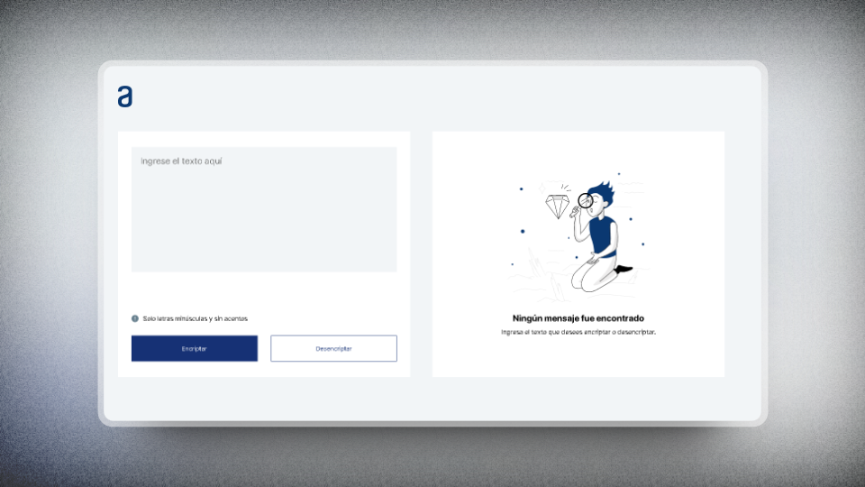

# Alura - Encriptador de Texto

## 📝 Descripción

¡Hola! Este desafío constituye una oportunidad para evaluar la capacidad lógica de los estudiantes de Alura. Espero les guste.

## ⚙️ Funcionalidad

- Encriptar textos
- Desencriptar textos
- Copiar el contenido del resultado

## 🛠️ Stack

- HTML
- CSS
- JavaScript
